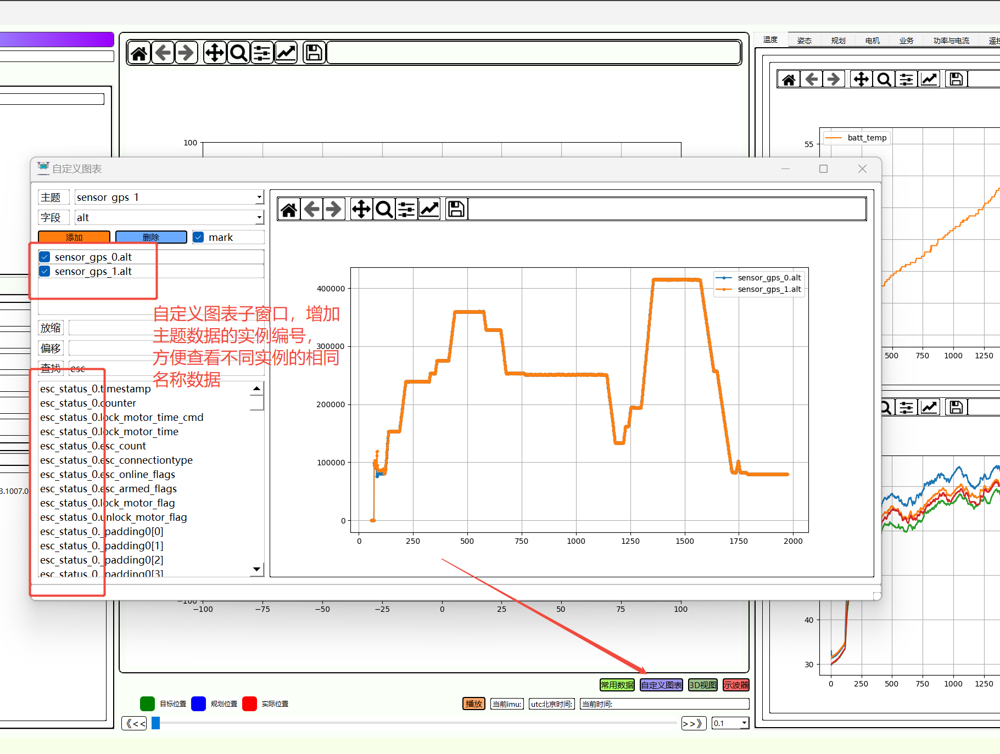
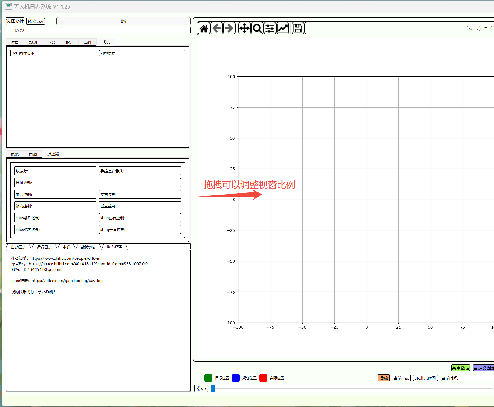
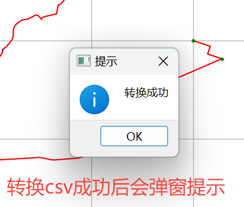
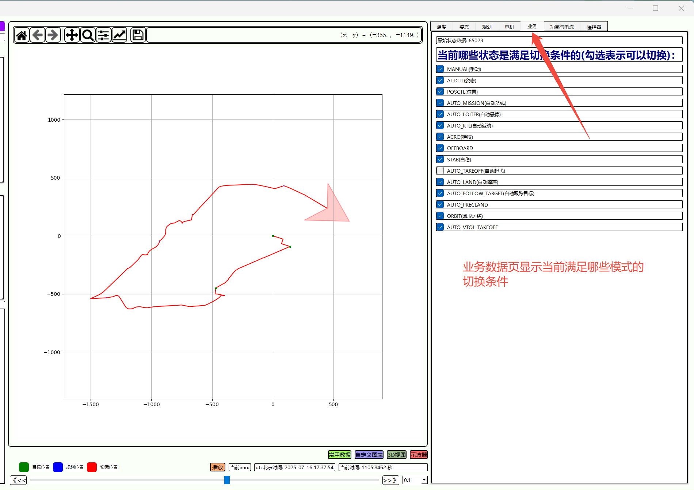
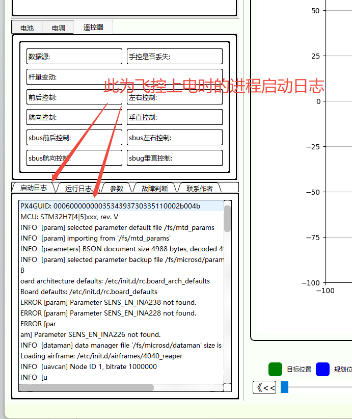
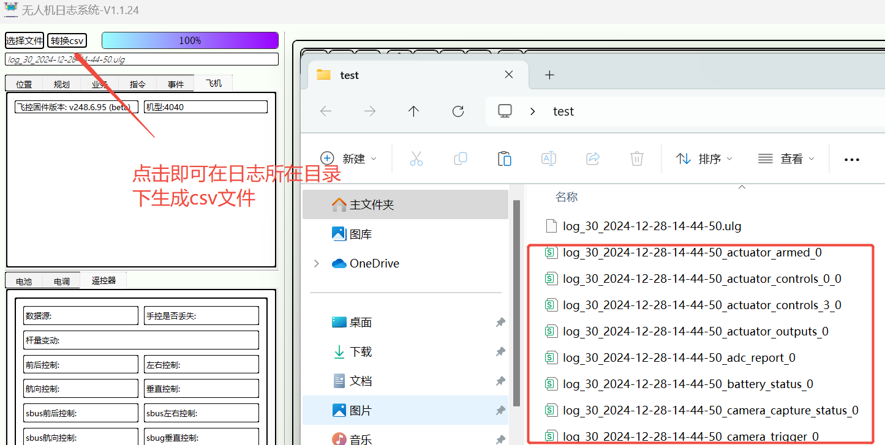
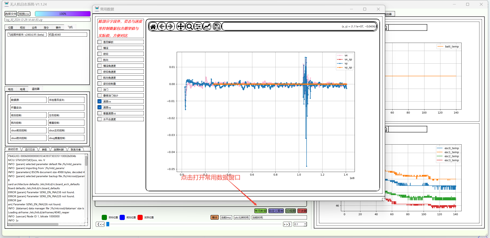
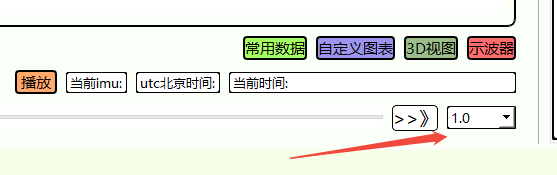

# uav_log

## 概述
此软件是px4飞控的日志工具，在无人机的日常问题排查过程中，看日志是必不可少的一个环节，飞机的本地日志是记录最全的信息，而 px4 的日志不是 excel 表格那样打开就能看，而是 ulog，以主题的方式来存储，这就给一些非开发人士带来了一些困难，还需要去了解 px4 内部的主题字段才行。
目前对于 ulog 日志的分析，要么是使用 FlightPlot，要么是用 Flight Review 网站，这两个工具也是很好用的工具，不过也是各有利弊吧，FlightPlot 不适合用于查看轨迹信息，在调试规划时，数据不够直观，例如 xy 二维的坐标轨迹，单纯的看 x 轴或者 y 轴是不太直观的；而 Flight Review 网站会将日志公布出去，另外网站需要网络，而且偶尔也会登不上去。因此，结合自己调试飞机经常查看的字段，制作了这个软件，也算是可以给大家一个新的工具选择吧，方便 px4 开发者以及无人机爱好者查看飞行日志。
主要的功能模块有：二维飞行轨迹显示，实时数据显示，字符日志与参数列表显示，总体图表显示，示波器，3D视图显示。
因为我的日志样本有限，而且大家用的 px4 的版本也都略有不同，所以难免会有一些 bug，如果你有日志读取异常，可以发给我调试，这样可以更好的完善这个工具。

## 1.1.26版本新增功能
### 修复自定义图表子界面的bug
将相同主题的数据名称后，增加实例编号，方便区分不同的实例数据，利用主副天线，sensor_gps_0,sensor_gps_1

## 1.1.25版本新增功能
### 支持动态调整视窗比例

### 转换csv按钮增加弹窗提示

### 增加业务数据页，提示当前满足哪些状态的切换条件

## 安装教程
免安装，打开即用

## 界面介绍
### 主界面
打开软件后，会进入软件的主界面，如下：

之后点击“选择文件”，会跳出文件选择界面，选择想要打开的日志：

之后软件左上角会显示读取的进度条，读取完成后，会展示一些信息：

主界面分为几个区域，如图所示：

拖动时间轴，实时数据，轨迹视图以及当前时间会根据当前时间来进行更新，如果有gps信息，也会将当前时间转化为北京时间：

每个图表都支持鼠标滚轮放缩，在工具栏上也可以使用其他的小功能，以及保存图片：

在时间轴上面有“播放”按钮，点击后，即可按一定的时间间隔来自动播放此日志：

在二维轨迹界面，会展示当前的无人机位置(红色线条)，规划算法的无人机轨迹目标位置(蓝色线条)，以及目标航点的位置(绿色线条)，红色箭头图表的朝向为飞机当前航向：

在总体图表中，会展示整个飞行过程的整体数据，有一些相同类型的，放在了一个图表展示，添加了勾选框，可以选择展示数据：

点击“自定义图表”，“3D视图”，“示波器”可以打开子窗口:

### 自定义图表界面介绍
主界面用于展示常用的数据，但可能还会有其他数据用户想要查看，自定义图表便是用于查看自己想要的字段数据，在打开了日志文件的基础上，才可以点击“自定义图表”按钮打开界面，打开界面后，会将日志中的所有主题字段数据用列表的形式展示出来：

点击添加按钮，即可将选中的主题添加到数据区域，并会生成一个勾选框，打勾会展示数据图表，点中某个字段数据后，点击删除，可以从数据区去掉此字段，“mark” 勾选框可以控制是否将数据点标记出来，点中某字段后，会显示当前字段的放缩倍数与偏移系数，可以手动调整：

在查找框中输入关键字，可以辅助查找相关的字段，在下方的区域会展示所有搜索出来的相关字段，例如输入“gps”：

之后再双击，即可将对应字段添加到数据区域：

### 3D视图界面介绍
打开3D视图子窗口，会显示整体的三维轨迹，以及实时的姿态数据：

在拖动时间轴时，飞机模型会根据实时的姿态数据，也会进行旋转来展示当前的姿态：

模型中，将电机进行了单独的绘制，用于表示当前是否解锁，以及电机控制量是否过大，当电机未解锁时，电机为灰色，解锁后，电机为绿色，当电机控制量过大(超过90%)时，变为红色：

### 示波器界面介绍
示波器界面的主题字段选择与自定义图表界面相同，包括放缩倍数，查找等功能，不同的是示波器只会显示当前时间前30秒内的数据，目的是方便观察一段时间内的数据变化，在这些的基础上，添加了一些常用的数据，例如：水平速度，垂直速度，功率等，就不需要再特意查字段换算了，并且显示了当前界面的最大值与最小值，方便查看这段时间内的数据范围：

## 1.1.24版本新增功能
### 上电启动日志解析
之前没有空去整理启动日志的解析，因此这部分是错的，现在修复了启动日志的解析与排版：

### 新增转换csv文件按钮
有一些玩家会想要看csv文件，但每次都要使用命令行，非常麻烦，因此新增了转换csv功能，在读取到日志后，点击按键，即可在日志目录下生成对应各个主题的 csv 文件：

### 新增常用数据窗口
在调试控制参数时，有一些字段需要经常查看，但有时候会忘记字段名字，因此新增了一个常用数据窗口，方便调试：

### 新增时间间隔选项
新增时间间隔选项，可以选择自动播放以及前进后退按钮的时间间隔：

## 视频说明链接
B站：https://www.bilibili.com/video/BV1RzxMezErP/?spm_id_from=333.999.0.0&vd_source=6058fea12f54eb56126b7896dcef7286
